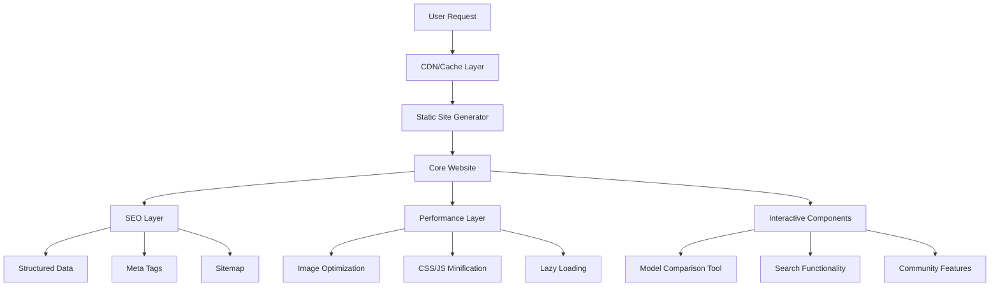

# Design Document

## Overview

This design document outlines the technical architecture and implementation approach for enhancing the ggufloader website with SEO optimization, mobile responsiveness, performance improvements, and user experience enhancements while maintaining a clean, business-class aesthetic.

## Architecture

### High-Level Architecture



### Technology Stack

- **Frontend**: Vanilla HTML5, CSS3, Progressive Enhancement JavaScript
- **Build Process**: Jekyll (existing) with custom plugins
- **Performance**: Image optimization, asset minification, lazy loading
- **SEO**: JSON-LD structured data, semantic HTML, optimized meta tags
- **Analytics**: Privacy-compliant tracking (Google Analytics 4 or similar)
- **Hosting**: GitHub Pages (existing) with CDN optimization

## Components and Interfaces

### 1. SEO Enhancement Layer

#### Structured Data Implementation

##### Homepage SoftwareApplication Schema
```javascript
// Enhanced JSON-LD for software application (homepage)
{
  "@context": "https://schema.org",
  "@type": "SoftwareApplication",
  "name": "GGUF Loader",
  "applicationCategory": "DeveloperApplication",
  "operatingSystem": ["Windows", "macOS", "Linux"],
  "softwareVersion": "2.0.0",
  "offers": {
    "@type": "Offer",
    "price": "0",
    "priceCurrency": "USD"
  },
  "downloadUrl": "https://github.com/ggufloader/gguf-loader/releases",
  "softwareRequirements": "Python 3.8+, 4GB RAM minimum",
  "featureList": [
    "Offline AI model execution",
    "Smart Floating Assistant",
    "Addon system",
    "Cross-platform compatibility"
  ]
}
```

##### Documentation Pages Structured Data Templates

**Installation Guide Schema:**
```javascript
{
  "@context": "https://schema.org",
  "@type": "TechArticle",
  "headline": "GGUF Loader Installation Guide",
  "description": "Complete guide to installing GGUF Loader on Windows, macOS, and Linux systems",
  "author": {
    "@type": "Person",
    "name": "Hussain Nazary"
  },
  "publisher": {
    "@type": "Organization",
    "name": "GGUF Loader"
  },
  "datePublished": "2025-01-27",
  "dateModified": "2025-01-27",
  "mainEntityOfPage": "https://ggufloader.github.io/docs/installation/",
  "articleSection": "Installation",
  "keywords": ["GGUF Loader", "installation", "setup", "Windows", "macOS", "Linux"]
}
```

**Quick Start Guide Schema:**
```javascript
{
  "@context": "https://schema.org",
  "@type": "HowTo",
  "name": "GGUF Loader Quick Start Guide",
  "description": "Get up and running with GGUF Loader in just a few minutes",
  "image": "https://ggufloader.github.io/preview.png",
  "totalTime": "PT5M",
  "estimatedCost": {
    "@type": "MonetaryAmount",
    "currency": "USD",
    "value": "0"
  },
  "supply": [
    {
      "@type": "HowToSupply",
      "name": "Python 3.8 or higher"
    },
    {
      "@type": "HowToSupply", 
      "name": "4GB RAM minimum"
    }
  ],
  "tool": [
    {
      "@type": "HowToTool",
      "name": "GGUF Loader"
    }
  ],
  "step": [
    {
      "@type": "HowToStep",
      "name": "Install GGUF Loader",
      "text": "pip install ggufloader"
    },
    {
      "@type": "HowToStep",
      "name": "Launch Application",
      "text": "ggufloader"
    }
  ]
}
```

**Addon Development Schema:**
```javascript
{
  "@context": "https://schema.org",
  "@type": "TechArticle",
  "headline": "GGUF Loader Addon Development Guide",
  "description": "Learn to create custom addons for GGUF Loader with examples and best practices",
  "author": {
    "@type": "Person",
    "name": "Hussain Nazary"
  },
  "publisher": {
    "@type": "Organization",
    "name": "GGUF Loader"
  },
  "datePublished": "2025-01-27",
  "dateModified": "2025-01-27",
  "mainEntityOfPage": "https://ggufloader.github.io/docs/addon-development/",
  "articleSection": "Development",
  "keywords": ["GGUF Loader", "addon development", "API", "Python", "extensions"],
  "about": {
    "@type": "SoftwareApplication",
    "name": "GGUF Loader"
  }
}
```

**API Reference Schema:**
```javascript
{
  "@context": "https://schema.org",
  "@type": "APIReference",
  "name": "GGUF Loader Addon API Reference",
  "description": "Complete API reference for developing GGUF Loader addons",
  "programmingLanguage": "Python",
  "targetProduct": {
    "@type": "SoftwareApplication",
    "name": "GGUF Loader"
  },
  "author": {
    "@type": "Person",
    "name": "Hussain Nazary"
  },
  "datePublished": "2025-01-27",
  "mainEntityOfPage": "https://ggufloader.github.io/docs/addon-api/"
}
```

**Smart Floater Example Schema:**
```javascript
{
  "@context": "https://schema.org",
  "@type": "CodeRepository",
  "name": "Smart Floating Assistant Example",
  "description": "Complete example of building addons for GGUF Loader using the Smart Floating Assistant",
  "programmingLanguage": "Python",
  "codeRepository": "https://github.com/ggufloader/gguf-loader",
  "author": {
    "@type": "Person",
    "name": "Hussain Nazary"
  },
  "isPartOf": {
    "@type": "SoftwareApplication",
    "name": "GGUF Loader"
  },
  "mainEntityOfPage": "https://ggufloader.github.io/docs/smart-floater-example/"
}
```

**Package Structure Schema:**
```javascript
{
  "@context": "https://schema.org",
  "@type": "TechArticle",
  "headline": "GGUF Loader Package Structure",
  "description": "Technical documentation of GGUF Loader's package structure and organization",
  "author": {
    "@type": "Person",
    "name": "Hussain Nazary"
  },
  "publisher": {
    "@type": "Organization",
    "name": "GGUF Loader"
  },
  "datePublished": "2025-01-27",
  "mainEntityOfPage": "https://ggufloader.github.io/docs/package-structure/",
  "articleSection": "Technical Documentation",
  "about": {
    "@type": "SoftwareApplication",
    "name": "GGUF Loader"
  }
}
```

#### Meta Tag Optimization
```html
<!-- Enhanced meta tags for each page -->
<meta name="description" content="[Unique 150-160 character description]">
<meta name="keywords" content="[Relevant, specific keywords]">
<meta name="robots" content="index, follow, max-image-preview:large">
<link rel="canonical" href="[Canonical URL]">

<!-- Open Graph optimization -->
<meta property="og:type" content="website">
<meta property="og:site_name" content="GGUF Loader">
<meta property="og:locale" content="en_US">

<!-- Twitter Card optimization -->
<meta name="twitter:card" content="summary_large_image">
<meta name="twitter:site" content="@ggufloader">
```

### 2. Mobile-First Responsive Design

#### Breakpoint Strategy
```css
/* Mobile-first approach */
/* Base styles: 320px+ */
.container {
  max-width: 100%;
  padding: 0 1rem;
}

/* Small tablets: 576px+ */
@media (min-width: 576px) {
  .container {
    max-width: 540px;
    margin: 0 auto;
  }
}

/* Tablets: 768px+ */
@media (min-width: 768px) {
  .container {
    max-width: 720px;
  }
}

/* Desktop: 992px+ */
@media (min-width: 992px) {
  .container {
    max-width: 960px;
  }
}

/* Large desktop: 1200px+ */
@media (min-width: 1200px) {
  .container {
    max-width: 1140px;
  }
}
```

#### Touch-Friendly Interface
```css
/* Minimum touch target sizes */
.btn, .nav-link, .download-link {
  min-height: 44px;
  min-width: 44px;
  padding: 12px 16px;
}

/* Improved spacing for mobile */
@media (max-width: 768px) {
  .nav-menu {
    flex-direction: column;
    gap: 1rem;
  }
  
  .model-card {
    margin-bottom: 1.5rem;
  }
}
```

### 3. Performance Optimization Layer

#### Image Optimization
```html
<!-- Responsive images with modern formats -->
<picture>
  <source srcset="image.avif" type="image/avif">
  <source srcset="image.webp" type="image/webp">
  
</picture>
```

#### Critical CSS Inlining
```html
<style>
  /* Critical above-the-fold CSS inlined */
  .hero { /* Critical styles */ }
  .nav { /* Critical styles */ }
</style>
<link rel="preload" href="styles.css" as="style" onload="this.onload=null;this.rel='stylesheet'">
```

#### JavaScript Optimization
```javascript
// Lazy load non-critical JavaScript
const loadScript = (src) => {
  const script = document.createElement('script');
  script.src = src;
  script.async = true;
  document.head.appendChild(script);
};

// Load after page interaction
document.addEventListener('DOMContentLoaded', () => {
  // Load model comparison tool on demand
  if (document.querySelector('.model-comparison')) {
    loadScript('js/model-comparison.js');
  }
});
```

### 4. Interactive Model Comparison Tool

#### Component Architecture
```javascript
class ModelComparisonTool {
  constructor(container) {
    this.container = container;
    this.models = [];
    this.userSpecs = {};
    this.init();
  }
  
  init() {
    this.loadModelData();
    this.createInterface();
    this.bindEvents();
  }
  
  loadModelData() {
    // Load model specifications from JSON
    this.models = [
      {
        name: "Mistral 7B Instruct",
        size: "4.1GB",
        minRAM: "8GB",
        recommendedRAM: "16GB",
        cpuRequirement: "Modern x64",
        performance: "Fast",
        useCase: "General purpose"
      }
      // ... more models
    ];
  }
  
  filterModels(specs) {
    return this.models.filter(model => {
      return this.isCompatible(model, specs);
    });
  }
  
  isCompatible(model, specs) {
    const ramGB = parseInt(specs.ram);
    const modelRAM = parseInt(model.minRAM);
    return ramGB >= modelRAM;
  }
}
```

#### User Interface
```html
<div class="model-comparison-tool">
  <div class="specs-input">
    <h3>Your System Specifications</h3>
    <div class="input-group">
      <label for="ram">RAM (GB)</label>
      <select id="ram">
        <option value="8">8 GB</option>
        <option value="16">16 GB</option>
        <option value="32">32 GB</option>
      </select>
    </div>
    <div class="input-group">
      <label for="cpu">CPU Type</label>
      <select id="cpu">
        <option value="intel-i5">Intel i5</option>
        <option value="intel-i7">Intel i7</option>
        <option value="amd-ryzen5">AMD Ryzen 5</option>
      </select>
    </div>
    <button id="find-models">Find Compatible Models</button>
  </div>
  
  <div class="results-table">
    <table id="model-results">
      <thead>
        <tr>
          <th>Model</th>
          <th>Size</th>
          <th>Performance</th>
          <th>Use Case</th>
          <th>Download</th>
        </tr>
      </thead>
      <tbody>
        <!-- Results populated by JavaScript -->
      </tbody>
    </table>
  </div>
</div>
```

### 5. Documentation Pages Structure

#### Individual Documentation Pages
Each documentation file from `/docs/` will become a dedicated page with SEO optimization:

```
/docs/
├── index.html (docs/README.md)
├── installation/
├── quick-start/
├── addon-development/
├── addon-api/
├── smart-floater-example/
├── package-structure/
└── user-guide/ (to be created)
```

#### Documentation Page Template
```html
<!DOCTYPE html>
<html lang="en">
<head>
  <meta charset="UTF-8">
  <meta name="viewport" content="width=device-width, initial-scale=1.0">
  <title>[Page Title] - GGUF Loader Documentation</title>
  <meta name="description" content="[Unique description for each doc page]">
  <link rel="canonical" href="https://ggufloader.github.io/docs/[page-slug]/">
  
  <!-- Breadcrumb structured data -->
  <script type="application/ld+json">
  {
    "@context": "https://schema.org",
    "@type": "BreadcrumbList",
    "itemListElement": [
      {
        "@type": "ListItem",
        "position": 1,
        "name": "Home",
        "item": "https://ggufloader.github.io"
      },
      {
        "@type": "ListItem", 
        "position": 2,
        "name": "Documentation",
        "item": "https://ggufloader.github.io/docs/"
      },
      {
        "@type": "ListItem",
        "position": 3,
        "name": "[Page Title]",
        "item": "https://ggufloader.github.io/docs/[page-slug]/"
      }
    ]
  }
  </script>
  
  <!-- Article structured data -->
  <script type="application/ld+json">
  {
    "@context": "https://schema.org",
    "@type": "TechArticle",
    "headline": "[Page Title]",
    "description": "[Page description]",
    "author": {
      "@type": "Person",
      "name": "Hussain Nazary"
    },
    "publisher": {
      "@type": "Organization",
      "name": "GGUF Loader"
    },
    "datePublished": "[Date]",
    "dateModified": "[Date]"
  }
  </script>
</head>
<body>
  <nav class="docs-nav" aria-label="Documentation navigation">
    <div class="nav-container">
      <a href="/" class="home-link">← GGUF Loader</a>
      <div class="breadcrumb">
        <a href="/docs/">Docs</a> / <span>[Current Page]</span>
      </div>
    </div>
  </nav>
  
  <main class="docs-main">
    <aside class="docs-sidebar">
      <nav class="docs-menu" aria-label="Documentation menu">
        <h3>Getting Started</h3>
        <ul>
          <li><a href="/docs/installation/">Installation Guide</a></li>
          <li><a href="/docs/quick-start/">Quick Start</a></li>
          <li><a href="/docs/user-guide/">User Guide</a></li>
        </ul>
        
        <h3>Development</h3>
        <ul>
          <li><a href="/docs/addon-development/">Addon Development</a></li>
          <li><a href="/docs/addon-api/">API Reference</a></li>
          <li><a href="/docs/smart-floater-example/">Smart Floater Example</a></li>
        </ul>
        
        <h3>Advanced</h3>
        <ul>
          <li><a href="/docs/package-structure/">Package Structure</a></li>
          <li><a href="/docs/configuration/">Configuration</a></li>
          <li><a href="/docs/troubleshooting/">Troubleshooting</a></li>
        </ul>
      </nav>
    </aside>
    
    <article class="docs-content">
      <header class="docs-header">
        <h1>[Page Title]</h1>
        <p class="docs-description">[Page description]</p>
      </header>
      
      <div class="docs-body">
        <!-- Converted markdown content -->
      </div>
      
      <footer class="docs-footer">
        <div class="docs-navigation">
          <a href="[previous-page]" class="nav-prev">← Previous: [Title]</a>
          <a href="[next-page]" class="nav-next">Next: [Title] →</a>
        </div>
        
        <div class="docs-meta">
          <p>Last updated: [Date]</p>
          <p><a href="https://github.com/ggufloader/gguf-loader/edit/main/docs/[filename].md">Edit this page</a></p>
        </div>
      </footer>
    </article>
  </main>
</body>
</html>
```

#### SEO-Friendly Interlinking Strategy
```html
<!-- Contextual internal links within content -->
<p>Before starting, make sure you have completed the 
<a href="/docs/installation/" title="GGUF Loader Installation Guide">installation process</a>.</p>

<p>For advanced users, see our 
<a href="/docs/addon-development/" title="Create Custom GGUF Loader Addons">addon development guide</a>.</p>

<!-- Related articles section -->
<section class="related-articles" aria-labelledby="related-heading">
  <h2 id="related-heading">Related Documentation</h2>
  <ul>
    <li><a href="/docs/quick-start/" title="Get started with GGUF Loader in minutes">Quick Start Guide</a></li>
    <li><a href="/docs/addon-api/" title="Complete API reference for addon development">Addon API Reference</a></li>
    <li><a href="/docs/troubleshooting/" title="Common issues and solutions">Troubleshooting</a></li>
  </ul>
</section>

<!-- Documentation hub links -->
<nav class="docs-hub-nav" aria-label="Documentation hub">
  <h3>Explore More</h3>
  <div class="hub-links">
    <a href="/docs/installation/" class="hub-link">
      <strong>Installation</strong>
      <span>Get GGUF Loader running on your system</span>
    </a>
    <a href="/docs/addon-development/" class="hub-link">
      <strong>Build Addons</strong>
      <span>Create custom extensions and integrations</span>
    </a>
    <a href="/docs/smart-floater-example/" class="hub-link">
      <strong>Smart Floater</strong>
      <span>Learn from the built-in addon example</span>
    </a>
  </div>
</nav>
```

#### Search Functionality
```javascript
class SiteSearch {
  constructor() {
    this.searchIndex = [];
    this.init();
  }
  
  init() {
    this.buildSearchIndex();
    this.createSearchInterface();
  }
  
  buildSearchIndex() {
    // Index all content for search
    const content = document.querySelectorAll('h1, h2, h3, p, li');
    content.forEach((element, index) => {
      this.searchIndex.push({
        id: index,
        text: element.textContent,
        element: element,
        url: window.location.pathname + '#' + (element.id || index)
      });
    });
  }
  
  search(query) {
    const results = this.searchIndex.filter(item => 
      item.text.toLowerCase().includes(query.toLowerCase())
    );
    return results.slice(0, 10); // Limit results
  }
}
```

### 6. Enhanced Homepage Floating Buttons

#### Expanded Floating Button System
```html
<!-- Enhanced floating buttons container -->
<div class="floating-container">
    <!-- Existing service buttons -->
    <button class="floating-button service-btn" data-service="email">
        <span class="btn-icon">📧</span>
        <span class="btn-text">Email Automation</span>
    </button>
    <button class="floating-button service-btn" data-service="document">
        <span class="btn-icon">📄</span>
        <span class="btn-text">Document Summarization</span>
    </button>
    <button class="floating-button service-btn" data-service="translate">
        <span class="btn-icon">🌐</span>
        <span class="btn-text">Book Translator</span>
    </button>
    <button class="floating-button service-btn" data-service="finance">
        <span class="btn-icon">💰</span>
        <span class="btn-text">AI Finance Assistant</span>
    </button>
    <button class="floating-button service-btn" data-service="tax">
        <span class="btn-icon">🧾</span>
        <span class="btn-text">AI Tax Calculator</span>
    </button>
    
    <!-- New interlinking buttons -->
    <a href="/docs/installation/" class="floating-button nav-btn" title="Complete installation guide for all platforms">
        <span class="btn-icon">⚙️</span>
        <span class="btn-text">Installation Guide</span>
    </a>
    <a href="/docs/quick-start/" class="floating-button nav-btn" title="Get started with GGUF Loader in minutes">
        <span class="btn-icon">🚀</span>
        <span class="btn-text">Quick Start</span>
    </a>
    <a href="/docs/addon-development/" class="floating-button nav-btn" title="Create custom addons and extensions">
        <span class="btn-icon">🔧</span>
        <span class="btn-text">Build Addons</span>
    </a>
    <a href="#download" class="floating-button nav-btn" title="Download GGUF models for your system">
        <span class="btn-icon">⬇️</span>
        <span class="btn-text">Download Models</span>
    </a>
    <a href="/docs/smart-floater-example/" class="floating-button nav-btn" title="Learn about the Smart Floating Assistant">
        <span class="btn-icon">✨</span>
        <span class="btn-text">Smart Floater</span>
    </a>
    <a href="/blog/" class="floating-button nav-btn" title="Tutorials, guides, and community content">
        <span class="btn-icon">📝</span>
        <span class="btn-text">Blog & Tutorials</span>
    </a>
    <a href="https://github.com/ggufloader/gguf-loader" class="floating-button nav-btn" title="Source code and community">
        <span class="btn-icon">💻</span>
        <span class="btn-text">GitHub</span>
    </a>
</div>
```

#### Enhanced Floating Button Styles
```css
.floating-container {
    position: absolute;
    top: 0;
    left: 0;
    width: 100%;
    height: 100%;
    pointer-events: none;
    z-index: 500;
}

.floating-button {
    position: absolute;
    min-width: 60px;
    height: 60px;
    padding: 0 max(15px, 1em);
    background: #ffffff;
    border: 2px solid #e9ecef;
    border-radius: 30px;
    font-size: 1rem;
    cursor: pointer;
    transition: all 0.3s ease;
    box-shadow: 0 4px 15px rgba(0, 0, 0, 0.1);
    pointer-events: auto;
    display: flex;
    align-items: center;
    justify-content: center;
    gap: 8px;
    white-space: nowrap;
    color: #495057;
    text-decoration: none;
}

/* Service buttons (existing functionality) */
.floating-button.service-btn {
    background: linear-gradient(135deg, #667eea 0%, #764ba2 100%);
    color: white;
    border-color: #667eea;
}

.floating-button.service-btn:hover {
    background: linear-gradient(135deg, #5a6fd8 0%, #6a4190 100%);
    transform: scale(1.1);
    box-shadow: 0 6px 20px rgba(102, 126, 234, 0.3);
}

/* Navigation buttons (new interlinking) */
.floating-button.nav-btn {
    background: #ffffff;
    border-color: #3498db;
}

.floating-button.nav-btn:hover {
    background: #3498db;
    color: white;
    transform: scale(1.05);
    box-shadow: 0 6px 20px rgba(52, 152, 219, 0.3);
}

/* Icon and text styling */
.btn-icon {
    font-size: 1.2em;
    flex-shrink: 0;
}

.btn-text {
    font-weight: 500;
    font-size: 0.9em;
}

/* Responsive adjustments */
@media (max-width: 768px) {
    .floating-button {
        min-width: 50px;
        height: 50px;
        font-size: 0.9rem;
        padding: 0 12px;
    }
    
    .btn-text {
        display: none; /* Show only icons on mobile */
    }
    
    .btn-icon {
        font-size: 1.4em;
    }
}

/* Accessibility improvements */
.floating-button:focus {
    outline: 2px solid #3498db;
    outline-offset: 2px;
}

.floating-button[aria-pressed="true"] {
    background: #2c3e50;
    color: white;
}

/* Tooltip for better UX */
.floating-button::after {
    content: attr(title);
    position: absolute;
    bottom: -35px;
    left: 50%;
    transform: translateX(-50%);
    background: rgba(0, 0, 0, 0.8);
    color: white;
    padding: 5px 10px;
    border-radius: 4px;
    font-size: 0.8em;
    white-space: nowrap;
    opacity: 0;
    pointer-events: none;
    transition: opacity 0.3s ease;
    z-index: 1000;
}

.floating-button:hover::after {
    opacity: 1;
}

@media (max-width: 768px) {
    .floating-button::after {
        display: block; /* Show tooltips on mobile since text is hidden */
    }
}
```

#### Smart Button Positioning Algorithm
```javascript
class FloatingButtonManager {
    constructor() {
        this.buttons = document.querySelectorAll('.floating-button');
        this.container = document.querySelector('.floating-container');
        this.positions = [];
        this.init();
    }
    
    init() {
        this.calculatePositions();
        this.positionButtons();
        this.bindEvents();
        
        // Reposition on window resize
        window.addEventListener('resize', () => {
            this.calculatePositions();
            this.positionButtons();
        });
    }
    
    calculatePositions() {
        const containerRect = this.container.getBoundingClientRect();
        const buttonCount = this.buttons.length;
        const radius = Math.min(containerRect.width, containerRect.height) * 0.35;
        const centerX = containerRect.width / 2;
        const centerY = containerRect.height / 2;
        
        this.positions = [];
        
        // Arrange buttons in a spiral pattern
        for (let i = 0; i < buttonCount; i++) {
            const angle = (i / buttonCount) * 2 * Math.PI;
            const spiralRadius = radius + (i * 10); // Slight spiral effect
            
            const x = centerX + Math.cos(angle) * spiralRadius;
            const y = centerY + Math.sin(angle) * spiralRadius;
            
            this.positions.push({ x, y });
        }
    }
    
    positionButtons() {
        this.buttons.forEach((button, index) => {
            const pos = this.positions[index];
            button.style.left = `${pos.x}px`;
            button.style.top = `${pos.y}px`;
            button.style.transform = 'translate(-50%, -50%)';
        });
    }
    
    bindEvents() {
        // Add click tracking for analytics
        this.buttons.forEach(button => {
            button.addEventListener('click', (e) => {
                const buttonType = button.classList.contains('service-btn') ? 'service' : 'navigation';
                const buttonText = button.querySelector('.btn-text')?.textContent || button.title;
                
                // Track button clicks
                if (typeof gtag !== 'undefined') {
                    gtag('event', 'floating_button_click', {
                        button_type: buttonType,
                        button_text: buttonText,
                        page_location: window.location.href
                    });
                }
            });
        });
    }
}

// Initialize when DOM is ready
document.addEventListener('DOMContentLoaded', () => {
    new FloatingButtonManager();
});
```

### 7. Community Integration Features

#### Testimonials Component
```html
<section class="testimonials" aria-labelledby="testimonials-heading">
  <h2 id="testimonials-heading">What Users Say</h2>
  <div class="testimonials-grid">
    <blockquote class="testimonial">
      <p>"GGUF Loader transformed how we deploy AI in our enterprise environment."</p>
      <cite>
        <strong>John Smith</strong>
        <span>CTO, Tech Corp</span>
      </cite>
    </blockquote>
    <!-- More testimonials -->
  </div>
</section>
```

#### Addon Showcase
```html
<section class="addon-showcase" aria-labelledby="addons-heading">
  <h2 id="addons-heading">Community Addons</h2>
  <div class="addon-grid">
    <article class="addon-card">
      <header>
        <h3>Smart Floating Assistant</h3>
        <span class="addon-author">by GGUF Team</span>
      </header>
      <p class="addon-description">Global text processing with AI</p>
      <footer>
        <a href="#" class="addon-link">Learn More</a>
      </footer>
    </article>
    <!-- More addons -->
  </div>
</section>
```

#### Documentation Site Map and URL Structure
```
https://ggufloader.github.io/
├── docs/                           # Documentation hub
│   ├── installation/               # docs/installation.md
│   ├── quick-start/               # docs/quick-start.md  
│   ├── addon-development/         # docs/addon-development.md
│   ├── addon-api/                 # docs/addon-api.md
│   ├── smart-floater-example/     # docs/smart-floater-example.md
│   ├── package-structure/         # docs/package-structure.md
│   └── user-guide/               # New comprehensive guide
├── blog/                          # Existing blog
└── [other pages]
```

#### Jekyll Configuration for Documentation
```yaml
# _config.yml additions
collections:
  docs:
    output: true
    permalink: /docs/:name/

defaults:
  - scope:
      path: "_docs"
      type: "docs"
    values:
      layout: "docs"
      toc: true
      edit_page: true

# Plugin for automatic internal linking
plugins:
  - jekyll-relative-links
  - jekyll-optional-front-matter
  - jekyll-readme-index
  - jekyll-titles-from-headings
```

#### Automatic Internal Link Generation
```liquid
<!-- _includes/docs-links.html -->



<section class="auto-links">
  <h3>Related Topics</h3>
  
    
      <a href="{{ doc.url }}" title="{{ doc.description }}">{{ doc.title }}</a>
    
  
</section>
```

## Data Models

### Documentation Page Schema
```json
{
  "docs": [
    {
      "slug": "installation",
      "title": "Installation Guide", 
      "description": "Complete guide to installing GGUF Loader on Windows, macOS, and Linux",
      "tags": ["setup", "getting-started", "installation"],
      "relatedDocs": ["quick-start", "troubleshooting"],
      "lastModified": "2025-01-27",
      "readingTime": "5 minutes",
      "difficulty": "beginner"
    },
    {
      "slug": "addon-development",
      "title": "Addon Development Guide",
      "description": "Learn to create custom addons for GGUF Loader with examples and best practices", 
      "tags": ["development", "addons", "api"],
      "relatedDocs": ["addon-api", "smart-floater-example"],
      "lastModified": "2025-01-27",
      "readingTime": "15 minutes", 
      "difficulty": "advanced"
    }
  ]
}
```

### Model Specification Schema
```json
{
  "models": [
    {
      "id": "mistral-7b-instruct",
      "name": "Mistral 7B Instruct",
      "version": "v0.2",
      "size": {
        "q4_0": "4.1GB",
        "q6_k": "6.2GB"
      },
      "requirements": {
        "minRAM": "8GB",
        "recommendedRAM": "16GB",
        "cpu": "x64",
        "gpu": "optional"
      },
      "performance": {
        "speed": "fast",
        "quality": "high",
        "tokensPerSecond": "15-20"
      },
      "useCase": ["general", "chat", "coding"],
      "downloads": {
        "q4_0": "https://huggingface.co/...",
        "q6_k": "https://huggingface.co/..."
      }
    }
  ]
}
```

### User System Specifications
```json
{
  "userSpecs": {
    "ram": "16GB",
    "cpu": "intel-i5",
    "gpu": "none",
    "os": "windows",
    "useCase": "general"
  }
}
```

## Error Handling

### Progressive Enhancement Strategy
```javascript
// Ensure core functionality works without JavaScript
if (typeof window !== 'undefined' && window.addEventListener) {
  // Enhanced features
  window.addEventListener('DOMContentLoaded', initEnhancements);
} else {
  // Fallback for basic functionality
  console.log('Enhanced features not available');
}

function initEnhancements() {
  try {
    // Initialize interactive components
    if (document.querySelector('.model-comparison')) {
      new ModelComparisonTool('.model-comparison');
    }
  } catch (error) {
    console.error('Enhancement initialization failed:', error);
    // Graceful degradation
  }
}
```

### Accessibility Error Handling
```css
/* Ensure content is accessible even if CSS fails */
.sr-only {
  position: absolute;
  width: 1px;
  height: 1px;
  padding: 0;
  margin: -1px;
  overflow: hidden;
  clip: rect(0, 0, 0, 0);
  white-space: nowrap;
  border: 0;
}

/* High contrast mode support */
@media (prefers-contrast: high) {
  .btn {
    border: 2px solid;
  }
}

/* Reduced motion support */
@media (prefers-reduced-motion: reduce) {
  * {
    animation-duration: 0.01ms !important;
    animation-iteration-count: 1 !important;
    transition-duration: 0.01ms !important;
  }
}
```

## Testing Strategy

### Performance Testing
- **Lighthouse CI**: Automated performance, SEO, and accessibility testing
- **Core Web Vitals**: Continuous monitoring of LCP, FID, CLS
- **Mobile Testing**: Device testing across different screen sizes and connection speeds

### SEO Testing
- **Structured Data Validation**: Google's Rich Results Test
- **Meta Tag Validation**: Social media preview testing
- **Crawlability Testing**: Search console monitoring

### Accessibility Testing
- **WAVE**: Web accessibility evaluation
- **axe-core**: Automated accessibility testing
- **Manual Testing**: Screen reader and keyboard navigation testing

### Cross-Browser Testing
- **Modern Browsers**: Chrome, Firefox, Safari, Edge
- **Mobile Browsers**: iOS Safari, Chrome Mobile, Samsung Internet
- **Progressive Enhancement**: Testing with JavaScript disabled

## Implementation Phases

### Phase 1: Foundation (Week 1-2)
- SEO optimization and structured data
- Mobile responsiveness improvements
- Performance optimization basics

### Phase 2: Interactive Features (Week 3-4)
- Model comparison tool implementation
- Search functionality
- Enhanced navigation

### Phase 3: Community Features (Week 5-6)
- Testimonials integration
- Addon showcase
- Analytics implementation

### Phase 4: Testing and Optimization (Week 7-8)
- Comprehensive testing
- Performance fine-tuning
- Documentation updates

This design ensures a clean, professional, SEO-friendly website that provides excellent user experience across all devices while maintaining the business-class aesthetic you requested.