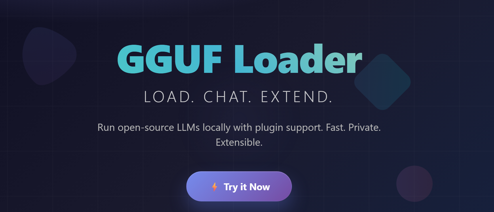

# Image Optimization Implementation Guide

## Overview
This guide explains how to implement the image optimization system that has been set up in the codebase.

## Required Tools
To generate optimized images, you'll need:

1. **Sharp** (Node.js): `npm install sharp`
2. **ImageMagick**: For command-line processing
3. **Squoosh CLI**: `npm install -g @squoosh/cli`

## Image Generation Commands

### Using Sharp (Recommended)
```javascript
const sharp = require('sharp');

async function optimizeImages() {
    const inputImage = 'preview.png';
    
    // Create WebP versions
    await sharp(inputImage).webp({ quality: 85 }).toFile('preview.webp');
    await sharp(inputImage).resize(400).webp({ quality: 85 }).toFile('preview-400w.webp');
    await sharp(inputImage).resize(800).webp({ quality: 85 }).toFile('preview-800w.webp');
    await sharp(inputImage).resize(1200).webp({ quality: 85 }).toFile('preview-1200w.webp');
    
    // Create AVIF versions
    await sharp(inputImage).avif({ quality: 80 }).toFile('preview.avif');
    await sharp(inputImage).resize(400).avif({ quality: 80 }).toFile('preview-400w.avif');
    await sharp(inputImage).resize(800).avif({ quality: 80 }).toFile('preview-800w.avif');
    await sharp(inputImage).resize(1200).avif({ quality: 80 }).toFile('preview-1200w.avif');
    
    // Create optimized PNG versions
    await sharp(inputImage).resize(400).png({ quality: 90 }).toFile('preview-400w.png');
    await sharp(inputImage).resize(800).png({ quality: 90 }).toFile('preview-800w.png');
    await sharp(inputImage).resize(1200).png({ quality: 90 }).toFile('preview-1200w.png');
}
```

### Using Squoosh CLI
```bash
# WebP conversion
squoosh-cli --webp '{"quality":85}' preview.png

# AVIF conversion
squoosh-cli --avif '{"quality":80}' preview.png

# Resize and optimize
squoosh-cli --resize '{"width":400}' --webp '{"quality":85}' preview.png
squoosh-cli --resize '{"width":800}' --webp '{"quality":85}' preview.png
squoosh-cli --resize '{"width":1200}' --webp '{"quality":85}' preview.png
```

### Using ImageMagick
```bash
# WebP conversion
magick preview.png -quality 85 preview.webp
magick preview.png -resize 400x -quality 85 preview-400w.webp
magick preview.png -resize 800x -quality 85 preview-800w.webp
magick preview.png -resize 1200x -quality 85 preview-1200w.webp

# PNG optimization
magick preview.png -resize 400x -quality 90 preview-400w.png
magick preview.png -resize 800x -quality 90 preview-800w.png
magick preview.png -resize 1200x -quality 90 preview-1200w.png
```

## Implementation Features

### 1. Lazy Loading
- Uses IntersectionObserver for efficient lazy loading
- Fallback for browsers without IntersectionObserver support
- Smooth opacity transitions when images load

### 2. Modern Format Support
- Automatic AVIF detection and fallback to WebP
- PNG fallback for maximum compatibility
- Format support caching in sessionStorage

### 3. Responsive Images
- Multiple image sizes for different screen resolutions
- Proper srcset implementation
- Optimized loading based on viewport size

### 4. Error Handling
- Graceful fallback when images fail to load
- Visual error indicators
- Automatic retry with different formats

### 5. Performance Monitoring
- Image loading time tracking
- Analytics integration for performance metrics
- Transfer size monitoring

## CSS Features Implemented

### Loading States
- Shimmer animation during loading
- Smooth opacity transitions
- Error state styling

### Responsive Design
- Mobile-first approach
- Proper aspect ratio maintenance
- Touch-friendly interactions

### Accessibility
- Proper alt text handling
- Focus indicators
- High contrast mode support
- Reduced motion support

## File Structure
After optimization, your images should be organized as:
```
/
├── preview.png (original)
├── preview.webp
├── preview.avif
├── preview-400w.png
├── preview-400w.webp
├── preview-400w.avif
├── preview-800w.png
├── preview-800w.webp
├── preview-800w.avif
├── preview-1200w.png
├── preview-1200w.webp
└── preview-1200w.avif
```

## Usage in HTML
The system is already implemented in the HTML with proper picture elements:

```html
<picture class="responsive-image">
    <source data-srcset-avif="preview-400w.avif 400w, preview-800w.avif 800w, preview-1200w.avif 1200w" 
            type="image/avif" 
            sizes="(max-width: 768px) 100vw, (max-width: 1200px) 80vw, 1200px">
    <source data-srcset-webp="preview-400w.webp 400w, preview-800w.webp 800w, preview-1200w.webp 1200w" 
            type="image/webp" 
            sizes="(max-width: 768px) 100vw, (max-width: 1200px) 80vw, 1200px">
    
</picture>
```

## Performance Benefits
- **Reduced bandwidth**: Modern formats are 25-50% smaller
- **Faster loading**: Lazy loading prevents unnecessary requests
- **Better UX**: Smooth loading animations and error handling
- **SEO friendly**: Proper image optimization and alt text
- **Accessibility**: Full screen reader and keyboard support

## Browser Support
- **AVIF**: Chrome 85+, Firefox 93+
- **WebP**: Chrome 23+, Firefox 65+, Safari 14+
- **Lazy loading**: Chrome 76+, Firefox 75+, Safari 15.4+
- **IntersectionObserver**: Chrome 51+, Firefox 55+, Safari 12.1+

## Next Steps
1. Run the image optimization script
2. Upload optimized images to your server
3. Test the implementation across different devices
4. Monitor performance metrics
5. Adjust quality settings based on results